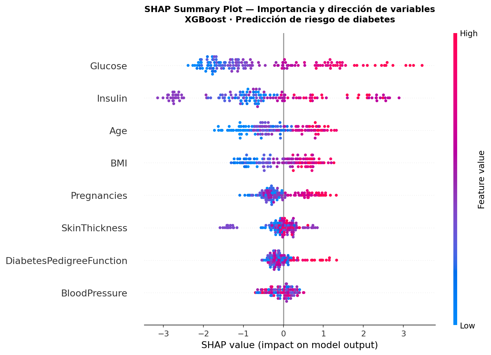
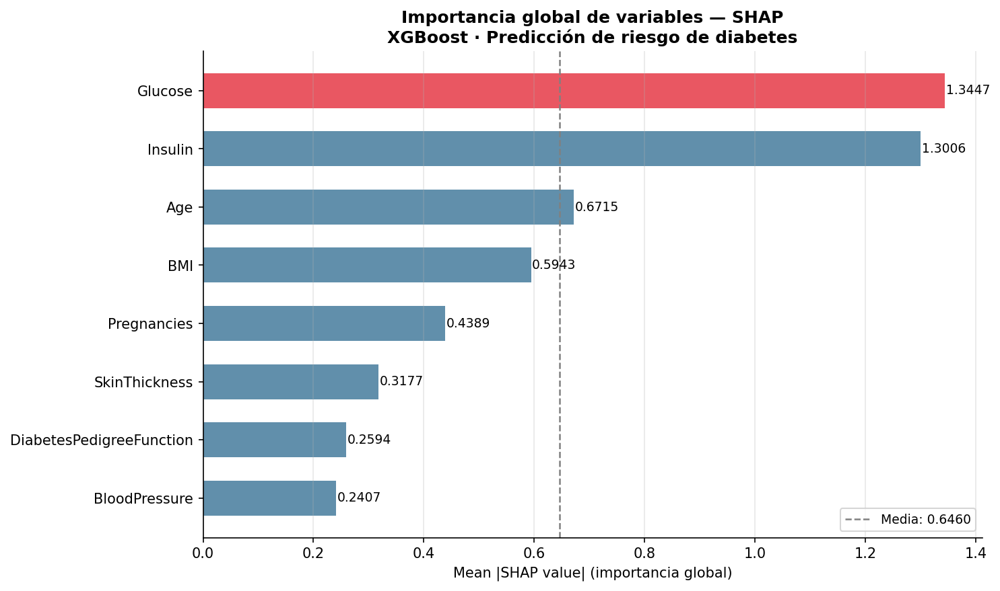
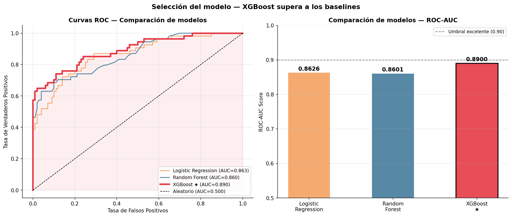
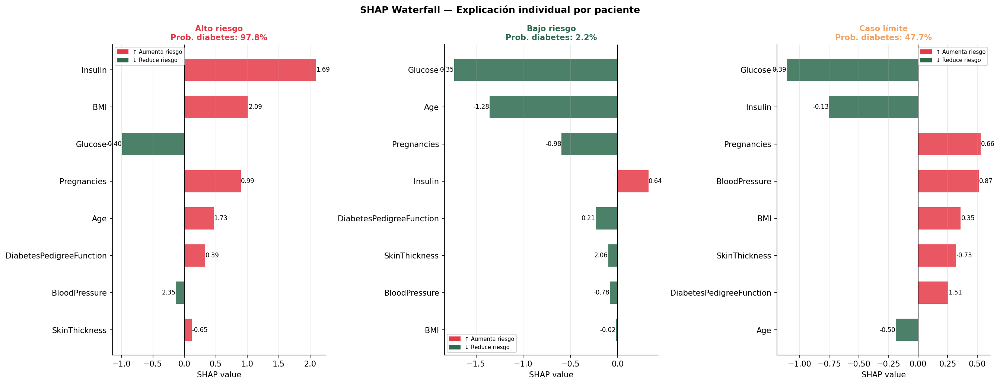

# 🩺 Sistema de Predicción de Riesgo de Diabetes
### XGBoost + Explicabilidad SHAP + App Streamlit

[](https://python.org)
[](https://xgboost.readthedocs.io)
[](https://shap.readthedocs.io)
[](https://streamlit.io)
[](LICENSE)

> *¿Puede un modelo predecir diabetes con 89% de ROC-AUC explicando cada decisión? Sí.*

---

## 🎯 Descripción del proyecto

Sistema de predicción de riesgo de diabetes que combina **precisión técnica** (XGBoost, ROC-AUC=0.89) con **explicabilidad clínica** (SHAP) y **usabilidad** (app Streamlit interactiva). El proyecto demuestra el pipeline completo de ML aplicado a salud: desde la imputación de datos faltantes hasta el despliegue de una herramienta usable por profesionales no técnicos.

---

## 📌 Hallazgos principales

| # | Hallazgo |
|---|---|
| 1 | **Glucosa** es el predictor más importante (SHAP=1.34) — validado clínicamente |
| 2 | **XGBoost ROC-AUC=0.89** supera a Regresión Logística (0.86) y Random Forest (0.86) |
| 3 | **SMOTE** mejoró el recall de la clase positiva al **69%** corrigiendo el desbalance |
| 4 | **CV ROC-AUC=0.9383 ± 0.007** — modelo estable en validación cruzada |
| 5 | **SHAP revela** que glucosa alta + BMI elevado generan riesgo desproporcionadamente mayor |

---

## 🛠️ Stack tecnológico

| Componente | Herramienta |
|---|---|
| Modelado | XGBoost 2.0 + scikit-learn |
| Balanceo de clases | SMOTE (imbalanced-learn) |
| Explicabilidad | SHAP (SHapley Additive exPlanations) |
| Visualización | matplotlib · seaborn |
| App interactiva | Streamlit |
| Dashboard | Power BI |
| Informe | ReportLab (PDF) |
| Entorno | Python 3.10 · Google Colab |

---

## 📁 Estructura del proyecto

```
diabetes-prediction-xgboost-shap/
│
├── data/
│   ├── raw/
│   │   └── diabetes.csv                    ← Dataset original UCI
│   └── processed/
│       └── diabetes_procesado.csv          ← Dataset con imputación
│
├── notebooks/
│   ├── 01_eda_exploracion.ipynb            ← Análisis exploratorio
│   ├── 02_preprocesamiento.ipynb           ← Imputación, SMOTE, scaling
│   ├── 03_modelo_xgboost.ipynb             ← Entrenamiento y comparación
│   ├── 04_explicabilidad_shap.ipynb        ← Análisis SHAP completo
│   └── 05_informe_final.ipynb              ← Generación del PDF
│
├── app/
│   └── app.py                              ← App Streamlit interactiva
│
├── models/
│   └── metricas.json                       ← Métricas del modelo (incluido)
│   └── xgboost_diabetes.pkl                ← Modelo serializado* (no incluido en repo)
│
├── dashboard/
│   └── dashboard_diabetes.pbix             ← Dashboard Power BI
│
├── report/
│   └── informe_final_diabetes.pdf          ← Informe completo PDF
│
├── images/
│   ├── 01_balance_clases.png
│   ├── 02_distribuciones.png
│   ├── 03_correlaciones.png
│   ├── 04_boxplots.png
│   ├── 05_valores_cero.png
│   ├── 06_comparacion_modelos.png
│   ├── 07_diagnostico_modelo.png
│   ├── 08_shap_summary.png
│   ├── 09_shap_importancia.png
│   ├── 10_shap_waterfall.png
│   └── 11_shap_dependence.png
│
├── README.md
└── requirements.txt
**Nota sobre el modelo serializado:** El archivo `xgboost_diabetes.pkl` no está incluido en el repositorio por razones de seguridad y tamaño. Para regenerarlo, ejecuta el notebook `03_modelo_xgboost.ipynb` completo — el modelo se entrena en menos de 30 segundos en Google Colab y se guarda automáticamente.
```

---

## 🗺️ Pipeline del proyecto

```
Datos UCI (768 pacientes)
        │
        ▼
Imputación de ceros imposibles
(mediana por clase)
        │
        ▼
Split estratificado 80/20
        │
        ▼
StandardScaler + SMOTE
(400 → 400 muestras por clase)
        │
        ▼
Entrenamiento XGBoost ──────── Baselines (LR, RF)
        │                              │
        ▼                              ▼
ROC-AUC = 0.8900 ◄──── Mejor modelo seleccionado
        │
        ▼
Análisis SHAP
(global + individual)
        │
        ▼
App Streamlit + Dashboard Power BI + Informe PDF
```

---

## 📊 Visualizaciones

### SHAP Summary Plot


### Importancia global de variables


### Comparación de modelos


### Explicación individual (Waterfall)


---

## 🤖 Métricas del modelo

| Métrica | Valor |
|---|---|
| ROC-AUC | **0.8900** |
| F1-Score | 0.7475 |
| CV ROC-AUC | **0.9383 ± 0.007** |
| Precisión global | 84.4% |
| Recall clase positiva | 69% |

### Comparación de modelos

| Modelo | ROC-AUC |
|---|---|
| Logistic Regression | 0.8626 |
| Random Forest | 0.8601 |
| **XGBoost** | **0.8900** ✓ |

---

## 🚀 Instalación y uso

```bash
# Clonar el repositorio
git clone https://github.com/TU-USUARIO/diabetes-prediction-xgboost-shap.git
cd diabetes-prediction-xgboost-shap

# Instalar dependencias
pip install -r requirements.txt

# Ejecutar los notebooks en orden (Google Colab recomendado)
# 01 → 02 → 03 → 04 → 05

# Ejecutar la app Streamlit
cd app
streamlit run app.py
```

---

## 📋 Dataset

**Pima Indians Diabetes Dataset** — UCI Machine Learning Repository

- **768 pacientes** (mujeres de herencia indígena Pima)
- **8 variables clínicas** + variable objetivo binaria
- **34.9% positivos** (desbalance moderado → tratado con SMOTE)
- **Licencia:** Open Data Commons

---

## 🔍 Decisiones técnicas clave

**¿Por qué XGBoost?** XGBoost es el algoritmo de referencia para datos tabulares estructurados. Maneja colinealidad nativamente, es robusto con outliers y gana competencias Kaggle desde 2016.

**¿Por qué SMOTE?** El dataset tiene 35% de casos positivos. Sin balanceo, el modelo aprende a predecir siempre "sin diabetes" y obtiene 65% de accuracy trivialmente. SMOTE genera muestras sintéticas de la clase minoritaria en el espacio de features.

**¿Por qué SHAP?** La importancia por ganancia de XGBoost es consistente pero no aditiva. SHAP tiene garantías matemáticas (eficiencia, simetría, dummy, aditividad) y permite comparar contribuciones entre pacientes.

---

## 👤 Autor

**Bryan Anthony López Guerrero**

[](https://linkedin.com/in/TU-PERFIL)
[](https://github.com/TU-USUARIO)

Ingeniero en Tecnologías de la Información | Máster en Visual Analytics y Big Data | Especialista en Big Data e IA

---

## 📄 Licencia

MIT License — ver [LICENSE](LICENSE)
